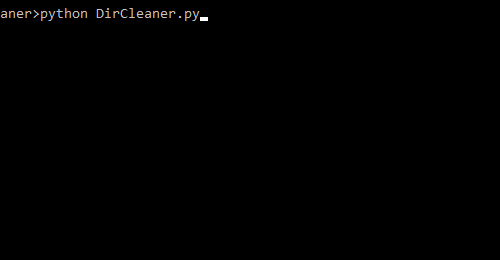
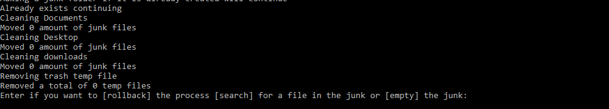
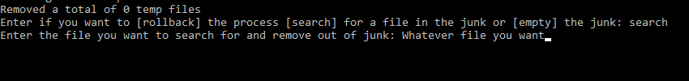
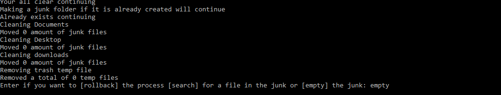
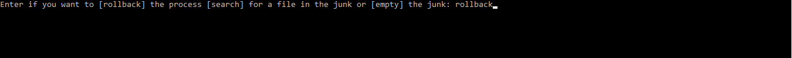

# DirCleaner
## Disclaimer
This program moves files around so you use it at your own risk. But I have implemented features which should stop data loss and clean you computer. But if it does I am not responsible. This program is still in beta stages.
## Features
This program has a filter which stops any files which are under three months from being moved.

This program also stops you from running the program as admin.

This program also has a rollback system which if you think oh no it has moved a lot of files I dont want it too move let it finish then you will be promped with a text bar saying the following do you want to [search] or [empty] or [rollback] proceed to type in rollback this will move all the files which were moved, back to their original place.

This program also only moves files which are under a 100 bytes.

You will notice I said move thats because the files are not instantly deleted and instead moved to a junk folder.
### How to use
First of all git clone or download zip for <https://github.com/WHYSOEASY/DirCleaner.git>

Then proceed to launch DirCleaner.py

Then after it has cleaned you will be prompted with this.

Search will allow you to search for a file in the junk and move or delete it.

Empty will delete all the files in the junk for you

And rollback will look inside the log file and reverse the changes. Putting all the files back from the most recent clean.

### Reporting bugs
Just put it in the issue part of the repo.
### What not to touch
DO NOT by any circumstance touch the log files these are used in the rollback feature.
### Updating
Just run the update.py to get the latest version.
